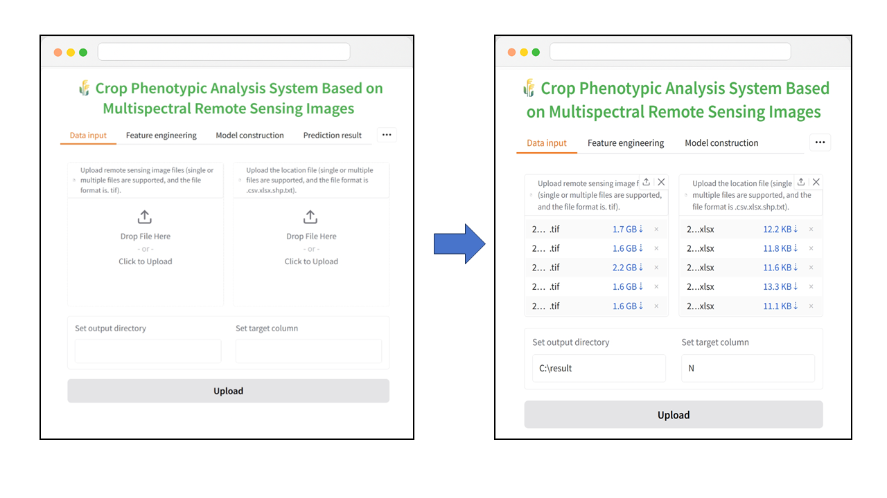

# Crop Phenotype Analysis Modeling Software (CPAM)

*An AutoML-Driven Software Platform for Crop Phenotype Analysis and Prescription Map Generation with Aerial Multispectral Imagery*

---

## Features

- **System Development**  
  Built an interactive Gradio-based system with Docker for cross-platform, user-friendly operation.

- **Index Integration**  
  Integrated 117 open-source vegetation indices for flexible and reusable multispectral analysis.

- **Automated Modeling**  
  Unified 15 machine learning and deep learning models into an automated workflow, simplifying modeling and boosting accuracy.

- **End-to-End Visualization**  
  Provides full-process visualization and automated prescription maps for precise agricultural decision-making.

---

## Overview

CPAM was developed entirely in Python. Its front-end interactive interface is built using **Gradio**, offering a modular architecture suitable for various analytical workflows.

The software integrates a variety of Python libraries, including:

- **SciPy** for data computation
- **Rasterio** for handling remote sensing imagery
- **Scikit-learn** for training machine learning models
- **TensorFlow** for developing deep learning models

---

CPAM encompasses five core components:

1. Data preprocessing
2. Vegetation index calculation
3. Feature engineering
4. Model training
5. Prescription map generation

This design ensures excellent flexibility and scalability, making CPAM suitable for diverse remote sensing modeling tasks such as agricultural phenotyping monitoring.

---


*Figure 1. Overall workflow of CPAM.*

---

The overall software interface is shown in **Figure 2**. The user interface comprises several pages:

- **Page A**: Data input
- **Page B**: Feature selection
- **Page C**: Model development
- **Page D**: Crop phenotypic parameter prediction and estimation
- **Page E**: Prescription map generation and visualization

The modular design enables users to perform customized analyses tailored to specific requirements. It allows flexible configuration of the entire workflow—from data acquisition to model output—all without requiring programming skills.

---


*Figure 2. CPAM user interface.*


## Installation

本项目依赖以下 Python 库：

- gradio
- pandas
- numpy==1.21.6
- matplotlib
- seaborn
- geopandas
- rasterio==1.3.9
- pyproj
- joblib
- tensorflow
- scipy==1.7.3
- scikit-learn
- xgboost
- openpyxl
- autogluon
- tpot

推荐使用 **Python 3.8**。

---

### ⚙️ 安装 GDAL

本项目涉及空间数据处理，推荐使用 **conda** 安装 GDAL，以避免复杂的依赖问题：

```bash
conda install -c conda-forge gdal
```

### 🔧 从 GitHub 安装

建议使用 conda 创建新的虚拟环境：

```bash
# 克隆仓库
git clone https://github.com/yourusername/yourproject.git
cd yourproject

# 创建 conda 虚拟环境
conda create -n Gradio python=3.10

# 激活环境
conda activate Gradio

# 安装依赖
pip install -r requirements.txt

# 启动项目
python Gradio_V11.py 
```
随后点击终端生成的链接即可打开软件界面
### 🐳 从 Docker 安装

如果不想手动配置 Python 环境，可以直接使用 Docker 镜像。

```bash
# 从 Docker Hub 拉取镜像
docker pull yourdockerhubusername/yourproject:latest

# 运行容器
docker run -it -p 7860:7860 yourdockerhubusername/yourproject:latest
```
随后在终端中查看输出的链接，点击即可打开软件界面。

## Usage

### Step 1: Prepare Input Files

Before using the software, ensure you have prepared the following input files:

- **Multispectral remote sensing imagery** of the farmland
- **Sampling point data** including coordinates and measured values

---

#### Supported Formats

- The sampling data file can be in:
  - CSV
  - Excel
  - TXT
  - SHP

- The remote sensing imagery may require some preprocessing to improve modeling accuracy and software performance.

---

#### Recommended Preprocessing Steps

- Threshold-based segmentation to remove background areas unrelated to farmland
- Cropping to retain only the target region of interest

---

#### Sampling Data Format

The sampling data file should contain **three columns**:

1. Measured value at each sampling point
2. Longitude of the sampling point
3. Latitude of the sampling point

---

The data preparation workflow is illustrated in **Figure 1**.


*Figure 3. Data preparation workflow.*

### Step 2: Upload Data to CPAM

Upload the preprocessed multispectral imagery and the sampling point file to **CPAM** in the specified order.

Manually enter:

- The output directory where the results will be saved
- The column name of the target variable (i.e., the measured value to be predicted) from the sampling file

This ensures accurate identification of the prediction target.

Once all settings are configured, click the **Upload** button to complete the data upload process.

The upload interface is shown in **Figure 2**.



*Figure 4. Data upload interface in CPAM.*

### Step 3: Configure Feature Engineering in CPAM

Click on the **Feature Engineering** tab and input the spectral bands of the multispectral images in order.

CPAM will automatically generate a set of checkboxes corresponding to the number of uploaded imagery files. Users can select one or more flight datasets to be included in the regression model construction.

Once any checkbox is selected, the vegetation index selection parameters are considered set. Click the **Submit Parameters** button to proceed.

---

After submission, CPAM will automatically:

- Extract spectral values at the sampling point locations
- Calculate **117 vegetation indices** from the built-in vegetation index library
- Perform feature selection based on these indices

The interface for this step is shown in **Figure 3**.


*Figure 5. Feature engineering interface in CPAM.*

### Step 4: Model Construction in CPAM

After feature selection is completed, the selected vegetation indices and the nitrogen content at sampling points are combined into a modeling dataset, which is saved in the output folder specified by the user.

Next, navigate to the **Model Construction** tab.

---

You have two options for model training:

- **Direct Training**: Use the automatically selected features from the previous step.
- **Upload Modeling File**: Upload a custom dataset prepared by the user for training.

---

After choosing the training method, click **Submit Modeling Data**. The system will automatically perform model training and evaluation on the input multispectral feature dataset.

The modeling process includes **15 algorithms** across three categories:

1. Traditional Machine Learning (ML)
2. Deep Learning (DL)
3. Automated Machine Learning (Auto-ML)

The modeling interface is shown in **Figure 4**.


*Figure 6. Model construction interface in CPAM.*

### Step 5: Perform Nitrogen Prediction with CPAM

Use the trained model to perform full-field nitrogen content prediction.

Navigate to the **Prediction Result** tab. Manually select the prediction model, then upload the multispectral imagery of the target field.

Click **Generate a Prediction Map** to start the prediction process.

---

After clicking the button, CPAM will automatically:

- Load the selected model
- Perform pixel-wise prediction over the entire field
- Save the prediction map to the user-defined output folder
- Generate and display a histogram of the predicted nitrogen content

---

Additionally, users can visualize specific vegetation indices by:

- Selecting an index from the dropdown list (based on previously identified sensitive indices)
- Clicking **Generate Indices Map** to create the corresponding vegetation index map

The prediction interface is shown in **Figure 5**.


*Figure 7. Prediction result interface in CPAM.*

### Step 6: Generate Prescription Map in CPAM

Navigate to the **Prescription Map Generation** tab.

---

**Steps:**

1. Upload the prediction map.
2. Select an appropriate colormap.
3. Use the slider to adjust the clipping range for outlier values in the image.
4. Click **Start Visualization** to generate the prediction value histogram and visualization map.

---

Next, set the **working width**, which defines the grid width for the prescription map. This value typically corresponds to the operating width of agricultural machinery.

---

Manually enter the following two parameters:

- **Standard nitrogen concentration**
- **Standard biomass**

These values are used to calculate the required fertilizer application rate.

---

Finally, click the **Generate Grid Diagram** button to create the nitrogen-level classified grid map.

The interface for prescription map generation is shown in **Figure 6**.


*Figure 8. Prescription map generation interface in CPAM.*

## Authors